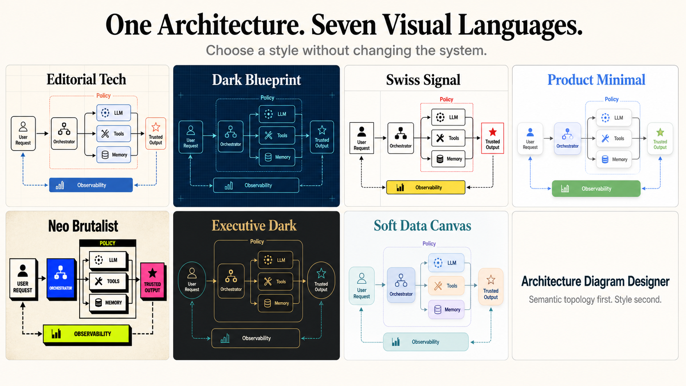

# Architecture Diagram Designer

**English** | [简体中文](README.zh-CN.md)

Turn system descriptions into semantically correct, visually polished architecture-diagram images with Codex.

```text
$architecture-diagram-designer
Generate an architecture diagram for an agent platform with an orchestrator,
LLM, tools, memory, policy guardrails, evaluation, and observability.
```

## What It Does

1. Extracts real actors, components, boundaries, and relationship types.
2. Chooses an appropriate architecture topology instead of forcing a generic flowchart.
3. Recommends three distinct visual styles when no style is specified.
4. Generates one standalone architecture-diagram image by default.

Supported topology families include system context, layered architecture, component maps, data flows, event-driven systems, hub-and-spoke control planes, deployments, trust zones, ecosystems, and feedback loops.

## Built-in Styles



| Style | Preview | Best fit |
|---|---|---|
| Editorial Tech | [View](showcase/classic-agent-system/editorial-tech.png) | AI systems, strategy, technical reports |
| Dark Blueprint | [View](showcase/classic-agent-system/dark-blueprint.png) | Infrastructure, runtime, networking |
| Swiss Signal | [View](showcase/classic-agent-system/swiss-signal.png) | Frameworks, standards, GitHub launches |
| Product Minimal | [View](showcase/classic-agent-system/product-minimal.png) | SaaS, developer experience, documentation |
| Neo Brutalist | [View](showcase/classic-agent-system/neo-brutalist.png) | Creative developer tools and open-source projects |
| Executive Dark | [View](showcase/classic-agent-system/executive-dark.png) | Leadership, governance, enterprise strategy |
| Soft Data Canvas | [View](showcase/classic-agent-system/soft-data-canvas.png) | Data products, approachable AI, education |

Every preview uses the same **Agent System Architecture — From Intent to Trusted Execution** topology and labels, so the comparison shows visual language rather than different information architecture.

## Style Selection

- Name a style to use it directly.
- Supply a visual reference to create a custom style while preserving independent topology selection.
- Omit the style to receive three recommendations.
- Say “choose automatically” or “直接生成” to let the skill select and render without pausing.

## Scope

This skill generates standalone architecture-diagram images. It does not create PPT slides, editable Mermaid/Graphviz/SVG diagrams, or generic illustrations.

## Installation

Copy this directory into your Codex-compatible skill directory:

```bash
cp -R architecture-diagram-designer ~/.agents/skills/architecture-diagram-designer
```

Restart Codex or begin a new task if the skill catalog does not refresh immediately.
